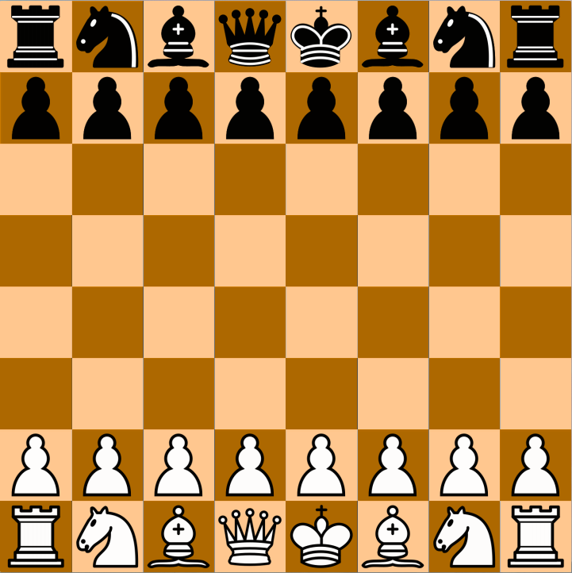

### pyChess
Making chess with python 🐍

The graphic library used to make this game is **pygame**.
You can install it using **pip** with the following command line:

```
pip install pygame
```

To download the project and run it, you just need to copy the next command lines and paste into the terminal:

**Linux/MacOs:**
```
git clone https://github.com/vggm/pyChess.git
cd pyChess/
python3 main.py
```

**Windows:**
```
git clone https://github.com/vggm/pyChess.git
cd pyChess/
py main.py
```
